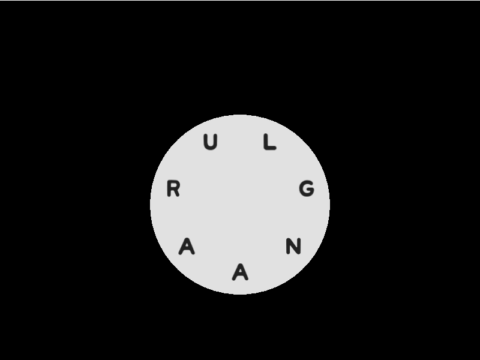

# Swipe

Swipe is a circluar keyboard designed to mimic the one used in the popular
mobile game [Wordscapes](https://play.google.com/store/apps/details?id=com.peoplefun.wordcross&hl=en_NZ&gl=US)



## Example

Check `main.lua` for a working example. Tested on mouse, technically speaking
should work for touch screens? Let me know if they don't.

## Usage

_(swipe.lua is pretty heavily commented, if you just wanted to skip this part!)_

Put `swipe.lua` somewhere into your project, and import the usual way

```lua
local Swipe = require "path.to.libs.swipe
```

Then initialise as follows

```lua
local keyboard = Swipe.new(
  -- cx for the keyboard
  love.graphics.getWidth() / 2,
  -- cy for the keyboard
  love.graphics.getHeight() / 2,
  -- initialLetters to seed the keyboard
  { "a", "n", "g", "l", "u", "r", "a" },
  )
```

Optionally, you can specify `options` to pass to the constructor. The defaults
are shown below:

```lua
local defaultOptions = {
  -- Wheel
  wheelColour = { 0.890, 0.890, 0.890 }, -- colour of the wheel background
  wheelRadius =  150, -- size of the wheel
  drawWheel = true, -- whether or not to actually _draw_ the wheel
  -- Text
  textColour = { 0.133, 0.133, 0.133 }, -- colour of the text on the wheel
  textFont = love.graphics.newFont(), -- the font to use to render the text
  -- Selected
  selectedColour = { 0.843, 0.176, 0.631 }, -- the highlight colour
  selectionRadius = 30 -- the radius of the select
}
```

Then, you'll need to attach `start`, `moved`, and `stop` event handlers.

- For a mouse, hook into `mousepressed`, `mousemoved` and `mousereleased`
- For touch devices, `touchpressed`, `touchmoved` and `touchreleased`

```lua
  local currentText = nil

  function love.mousepressed(x, y, button)
    keyboard:start(button, x, y)
    -- or keyboard:start(id, x, y) for touchpressed
    currentText = keyboard:get()
  end

  function love.mousemoved(x, y)
    keyboard:moved(x, y)
    -- TAKE NOTE OF THE ID:
    -- or keyboard:touchMoved(id, x, y) for touchmoved
    currentText = keyboard:get()

  end

  function love.mousereleased(x, y, button)
    currentText = keyboard:stop(button, x, y)
    -- or keyboard:stop(id, x, y) for touchreleased
  end
```

Make sure to pass in the `button` or `id` to the `start`/`stop` functions to
ensure it's tracking the right pointer.

`stop` will return the final list of letters that were selected, otherwise you
can call `get` while you are currently swiping on the keyboard to retrieve the
selected letters in order. If you call `get` when you are _not_ swiping, then
it'll return `nil`.

To update the keyboard's letters, you can call `keyboard:setLetters(newLetters)`

## To-do

- Wordscapes allows for you to "undo" a swipe by just reversing your steps.
  Simple enough addition, but not something I've gotten around to do just yet!

## Attribution

Example font is `mini-wakuwaku` by miniyama, gratefully retrieved from
https://www.freejapanesefont.com/mini-wakuwaku/
